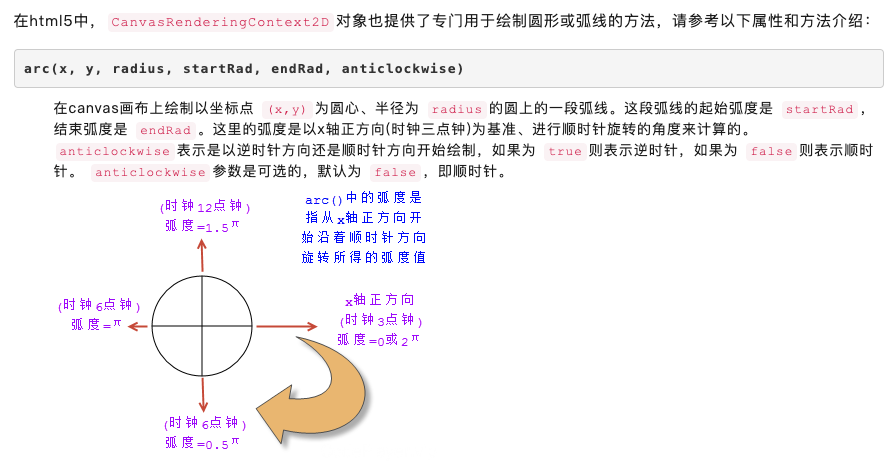

- beginPath()不要滥用，画一个新的图形的时候才用
- clearRect() 清楚矩形-橡皮擦

### 绘制圆形
计算文字坐标
x = x0 + Math.cos(度数) 
y = y0+Math.sin(度数)

顶线 基线 中线 底线 行距(上下行距是相等的)
行高的定义: 两行文本基线的距离就是行高
textbaseline 文字基线 
arc(x, y, radius, startAngle, endAngle, counterclockwise)
x为x坐标，y为y坐标，radius为半径，startAngle为开始弧度，endAngle为结束弧度,counterclockwise为逆时针
如果为 true则表示逆时针，如果为 false则表示顺时针。 anticlockwise参数是可选的，默认为 false，即顺时针。
 